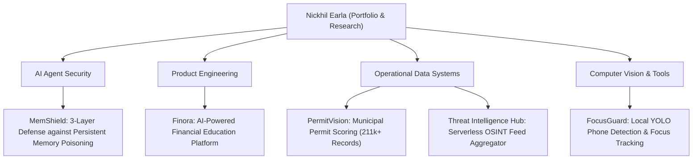

# Nickhil Earla

> **Student Founder & AI Product Builder**  
> *Architecting human-centered AI products, autonomous agent security research, and high-throughput data intelligence systems.*

[Website](https://usefinora.com/about) • [MemShield Paper](https://revsoc.ai/research/memshield) • [Finora Platform](https://usefinora.com) • [LinkedIn](https://linkedin.com)

---

## Technical Overview & Focus Areas

I build software platforms and security systems designed to turn complex data into usable, high-leverage decisions:

---

## Featured Work & Case Studies

### 1. 🛡️ [MemShield Research](https://github.com/MysticX662/MemShieldResearch)
*Three-layer defense architecture for persistent memory poisoning in stateful autonomous AI agents.*
- **Role**: Lead Author & Security Researcher
- **Key Contributions**: Modeled persistent RAG memory injection attacks; built a 3-layer inspection pipeline (Static Heuristic Filter, Semantic Vector Anomaly Detector, Runtime Execution Guard).
- **Artifacts**: [Whitepaper & Technical Documentation](https://revsoc.ai/research/memshield) • [CITATION.cff](https://github.com/MysticX662/MemShieldResearch/blob/main/CITATION.cff)

### 2. 🎓 [Finora — Engineering Case Study](https://github.com/MysticX662/Finora-Engineering-Case-Study)
*AI-powered financial education platform delivering personalized learning paths and interactive simulations for high school students.*
- **Role**: Founder & Lead Product Architect
- **Key Contributions**: Designed the full-stack architecture (React, TypeScript, Supabase); built the adaptive AI assistant ("Finny") with prompt guardrails; engineered student progress & educator analytics workflows.
- **Platform**: [usefinora.com](https://usefinora.com)
- *Note: Production infrastructure, student data, and source code remain private under organizational governance.*

### 3. 📊 [PermitVision — Case Study](https://github.com/MysticX662/PermitVision-Case-Study)
*Municipal permit data intelligence and scoring pipeline analyzing 211,000+ permit records into 52,662 ranked opportunities.*
- **Role**: Lead Data & Systems Engineer
- **Key Contributions**: Built multi-source ingestion scripts; designed entity resolution algorithms for address/contractor normalization; implemented a deterministic scoring engine.
- *Note: Commercial data exports and client rules remain private.*

### 4. 🌐 [Threat Intelligence Hub](https://github.com/MysticX662/Threat-Intelligence-Hub)
*Serverless OSINT threat feed aggregator with Python collectors, versioned JSON feeds, and a Next.js dashboard.*
- **Role**: Creator & Systems Engineer
- **Key Contributions**: Engineered automated feed collectors, JSON schema versioning, and static API deployment without server maintenance.

### 5. 🎯 [FocusGuard](https://github.com/MysticX662/FocusGuard)
*Computer-vision-based phone detection and focus tracking application.*
- **Role**: Sole Developer
- **Key Contributions**: Integrated local YOLO object detection with OpenCV; designed temporal debouncing filters; built zero-cloud privacy architecture.

### 6. 🚀 [FrontierBuild — Case Study](https://github.com/MysticX662/FrontierBuild-Case-Study)
*Operations and technology case study for student technology builder programs and competition systems.*
- **Role**: Director of Operations & Technology
- **Key Contributions**: Built registration workflows, automated judge routing scripts, and managed hackathon competition execution.

---

## Core Technical Competencies

- **Languages & Runtimes**: Python, TypeScript, JavaScript, SQL, HTML5/CSS3, Node.js
- **Frontend & Web Systems**: React, Next.js, Vite, TailwindCSS, State Management
- **Backend & Cloud Infrastructure**: Supabase, PostgreSQL, Row Level Security (RLS), REST APIs, Serverless Functions
- **AI & Security Engineering**: LLM System Defense, RAG Architecture, OpenCV, YOLO Object Detection, OSINT Feed Aggregation
- **Engineering Practices**: Git, CI/CD, Automated Testing, Linux Environment, Architecture Documentation

---

## Technical Portfolio & Privacy Policy

Commercial products, municipal datasets, and institutional partnerships involve private codebases, student privacy protections, and client confidentiality agreements. Selected repositories on this profile function as public engineering case studies, white papers, or open utilities.

For research inquiries, technical discussions, or collaboration:
- **Platform**: [usefinora.com](https://usefinora.com)
- **About**: [usefinora.com/about](https://usefinora.com/about)
